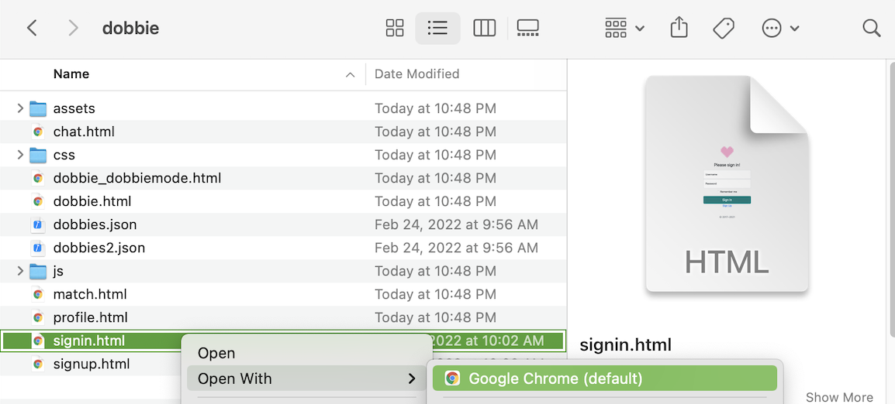

# connect4-Project
# DOBBIE: Date Our Bestie

## Description
DOBBIE works to transform the online dating experience through support from friends (dobbies) to strengthen interpersonal trust that is normally not present on online dating platforms. We are experimenting with new ways to create a transparent and wholesome dating environment. You can learn more about the development process here: https://uwsocialcomputing.github.io/connect4/

## Installation/Prototype Usage/Testing
To test the DOBBIE prototype, this project can be cloned and run locally. At this moment in the implementation process, the prototype can only be run locally.

Once cloned, open dobbie/signin.html to begin, opening in Chrome.

## Authors and Acknowledgements
This project was developed as part of the UW CSE 481P Social Computing Capstone course by Emily Chang, Simona Liao, Renee Wang, and Felicia Yan. 
Special thanks to Professor Amy Zhang and Ruotong Wang for their support and guidance on this project!

